<p align="center">
  
</p>

<p align="center">
  <a href="https://www.npmjs.com/package/react-native-smart-keyboard-view">
    
  </a>
  
  
  
  
  
  
</p>

<br />

A complete rewrite of the popular `react-native-keyboard-aware-scroll-view` (5.4k+ stars), fixing critical bugs and bringing the library up to modern React Native standards.

---

## The Problem

The original `react-native-keyboard-aware-scroll-view` hasn't been maintained since 2021 and has **165+ open issues**:

- Android 15/16 keyboard incompatibility
- Screen bouncing when focusing inputs
- Reset to top when switching TextInputs
- Broken ref methods (`scrollTo`, `scrollToEnd`)
- Extra bottom space appearing randomly
- Flow types instead of TypeScript
- Class components instead of hooks

## The Solution

Built from scratch with modern patterns:

- **Hooks architecture** — `useKeyboardAwareScroll`, `useKeyboard`
- **TypeScript native** — full type exports, zero `any` in public API
- **`forwardRef` + `useImperativeHandle`** — proper ref handling
- **Zero dependencies** — no `react-native-iphone-x-helper`
- **React Native 0.72+** compatible

---

## Installation

```bash
npm install react-native-smart-keyboard-view
# or
yarn add react-native-smart-keyboard-view
```

## Quick Start

```tsx
import { KeyboardAwareScrollView } from 'react-native-smart-keyboard-view'

function MyScreen() {
  return (
    <KeyboardAwareScrollView style={{ flex: 1 }}>
      <TextInput placeholder="First input" />
      <TextInput placeholder="Second input" />
      <TextInput placeholder="Third input" />
    </KeyboardAwareScrollView>
  )
}
```

That's it. Your inputs will automatically scroll into view when the keyboard appears.

---

## Usage

### With Ref

```tsx
import { useRef } from 'react'
import { KeyboardAwareScrollView, KeyboardAwareScrollRef } from 'react-native-smart-keyboard-view'

function MyScreen() {
  const scrollRef = useRef<KeyboardAwareScrollRef>(null)

  return (
    <KeyboardAwareScrollView ref={scrollRef} style={{ flex: 1 }}>
      <TextInput onFocus={() => scrollRef.current?.scrollToPosition(0, 200)} />
    </KeyboardAwareScrollView>
  )
}
```

### KeyboardAwareFlatList

```tsx
import { KeyboardAwareFlatList } from 'react-native-smart-keyboard-view'

function MyList() {
  return (
    <KeyboardAwareFlatList
      data={items}
      renderItem={({ item }) => <TextInput value={item.value} />}
      extraHeight={100}
    />
  )
}
```

### KeyboardAwareSectionList

```tsx
import { KeyboardAwareSectionList } from 'react-native-smart-keyboard-view'

function MySections() {
  return (
    <KeyboardAwareSectionList
      sections={data}
      renderItem={({ item }) => <TextInput value={item.value} />}
      renderSectionHeader={({ section }) => <Text>{section.title}</Text>}
    />
  )
}
```

### useKeyboard Hook

```tsx
import { useKeyboard } from 'react-native-smart-keyboard-view'

function MyComponent() {
  const { isVisible, height } = useKeyboard()

  return (
    <View style={{ paddingBottom: isVisible ? height : 0 }}>
      {/* content */}
    </View>
  )
}
```

---

## API Reference

### Props

| Prop | Type | Default | Description |
|------|------|---------|-------------|
| `enableAutomaticScroll` | `boolean` | `true` | Auto-scroll to focused TextInput |
| `extraHeight` | `number` | `75` | Extra offset above the keyboard |
| `extraScrollHeight` | `number` | `0` | Extra scroll height |
| `enableResetScrollToCoords` | `boolean` | `true` | Reset scroll position when keyboard hides |
| `resetScrollToCoords` | `{x, y}` | `undefined` | Custom reset coordinates |
| `keyboardOpeningTime` | `number` | `250` | Delay before scrolling (ms) |
| `viewIsInsideTabBar` | `boolean` | `false` | Adjust for TabBar height |
| `enableOnAndroid` | `boolean` | `true` | Enable keyboard handling on Android |
| `onKeyboardWillShow` | `(frame) => void` | - | Keyboard will show callback |
| `onKeyboardWillHide` | `(frame) => void` | - | Keyboard will hide callback |
| `onKeyboardDidShow` | `(frame) => void` | - | Keyboard did show callback |
| `onKeyboardDidHide` | `(frame) => void` | - | Keyboard did hide callback |

### Ref Methods

| Method | Description |
|--------|-------------|
| `scrollToPosition(x, y, animated?)` | Scroll to specific position |
| `scrollToEnd(animated?)` | Scroll to end of content |
| `scrollToFocusedInput(ref, options?)` | Scroll to a specific TextInput |
| `scrollIntoView(ref, options?)` | Scroll to make an element visible |
| `getScrollResponder()` | Get the underlying ScrollView responder |
| `update()` | Re-trigger scroll to current focused input |

### Hooks

#### `useKeyboardAwareScroll(options?)`

Low-level hook for custom implementations. Returns all scroll handlers and keyboard state.

#### `useKeyboard(options?)`

Standalone hook for keyboard state. Returns `{ isVisible, height, frame }`.

---

## Migration from `react-native-keyboard-aware-scroll-view`

| Old | New | Notes |
|-----|-----|-------|
| `innerRef` | `ref` | Use standard `ref` prop |
| `listenToKeyboardEvents` HOC | `useKeyboardAwareScroll` hook | Hooks instead of HOC |
| `enableOnAndroid` default `false` | default `true` | Now enabled by default |
| All other props | Same | Backward compatible |

---

## Testing

```bash
yarn test --coverage
```

| Module | Stmts | Branch | Funcs | Lines |
|--------|-------|--------|-------|-------|
| **Overall** | **89.5%** | **75.9%** | **87%** | **90.3%** |
| `useKeyboard` | 100% | 100% | 100% | 100% |
| `useKeyboardAwareScroll` | 94.2% | 84.8% | 100% | 97.1% |
| `platform.ts` | 100% | 100% | 100% | 100% |
| `measureElement` | 100% | 100% | 100% | 100% |
| `KeyboardAwareScrollView` | 76.9% | 78.6% | 66.7% | 76.9% |

86 tests across 8 suites covering keyboard events, automatic scroll, reset behavior, ref forwarding, Android specifics, and edge cases.

---

## Contributing

1. Fork the repo
2. Create your feature branch (`git checkout -b feature/my-feature`)
3. Commit your changes (`git commit -m 'Add my feature'`)
4. Push to the branch (`git push origin feature/my-feature`)
5. Open a Pull Request

## License

MIT
